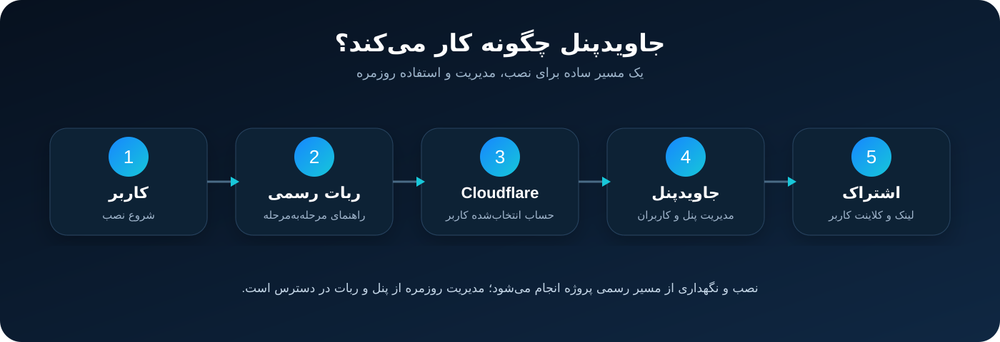

  

# جاویدپنل

### پنل سبک و ساده برای استفاده شخصی و خانوادگی روی Cloudflare

**[🤖 نصب با ربات رسمی](https://t.me/javidpanelbot)** · **[📚 راهنماها](docs/fa/index.md)** · **[📢 کانال رسمی](https://t.me/javidpnl)**

---

## جاویدپنل چیست؟

**جاویدپنل** یک پنل رایگان برای استفاده شخصی و خانوادگی است که روی حساب Cloudflare خود کاربر راه‌اندازی می‌شود. نصب و نگهداری پنل از طریق ربات رسمی انجام می‌شود تا شروع کار، بروزرسانی و مدیریت روزمره ساده و یکپارچه باشد.

بعد از نصب می‌توانید برای اعضای خانواده یا دستگاه‌های مختلف کاربر جداگانه بسازید، مدت اعتبار و محدودیت حجم را مدیریت کنید و لینک اشتراک مناسب کلاینت‌های مختلف را در اختیار هر کاربر قرار دهید.
نسخه 0.7.2 اتصال نصب‌ها و لینک‌های قبلی 0.6.x را حفظ می‌کند و امکانات Fragment، آی‌پی تمیز، لیست proxy کشورها و نمایش پرچم نودها را به پنل اضافه می‌کند.

<table>
<tr>
<td width="25%" align="center"><b>⚡ نصب ساده</b> راه‌اندازی مرحله‌به‌مرحله از ربات رسمی</td>
<td width="25%" align="center"><b>👥 مدیریت کاربران</b> ساخت و مدیریت کاربران مستقل</td>
<td width="25%" align="center"><b>🤖 مدیریت از تلگرام</b> مدیریت مستقیم کاربران هر پنل از ربات</td>
<td width="25%" align="center"><b>🔄 نگهداری آسان</b> بروزرسانی، نصب مجدد و مدیریت پنل‌ها</td>
</tr>
</table>

## نسخه 0.7.2

- ارتقاء مستقیم نصب‌های 0.6.x بدون تغییر رمز، کاربران، فضای داده و لینک‌های قبلی
- دریافت لیست proxy کشورها از مسیر رسمی همین مخزن
- پشتیبانی از آی‌پی‌های تمیز، Fragment و تنظیمات کامل اتصال در پنل
- نمایش پرچم کشور انتخاب‌شده در نودهای خروجی
- اصلاح مسیرهایی که باعث عدم اتصال نودهای دریافت‌شده از Subscription می‌شدند

## سازوکار کلی

  

کاربر از طریق ربات رسمی نصب را آغاز می‌کند، پنل روی حساب Cloudflare او راه‌اندازی می‌شود و سپس مدیریت کاربران، دریافت لینک اشتراک و عملیات نگهداری از پنل یا ربات رسمی در دسترس خواهد بود.

## شروع سریع

1. ربات رسمی **[@javidpanelbot](https://t.me/javidpanelbot)** را باز کنید.
2. گزینه **«نصب پنل جدید»** را انتخاب کنید.
3. از دکمه داخل ربات، Cloudflare API Token محدود بسازید.
4. Token را فقط برای ربات رسمی ارسال کنید.
5. در صورت وجود چند Account، حساب موردنظر را انتخاب کنید.
6. پس از پایان نصب، آدرس پنل و اطلاعات ورود را دریافت کنید.

> برای نصب، نیازی به دانلود فایل از GitHub نیست. مسیر رسمی نصب، ربات **@javidpanelbot** است.

**[راهنمای کامل نصب →](docs/fa/installation.md)**

## مدیریت کاربران از ربات

یکی از امکانات کاربردی جاویدپنل، مدیریت مستقیم کاربران هر پنل از طریق ربات رسمی است. از بخش **«پنل‌های من»**، پنل موردنظر را انتخاب کنید و وارد **«مدیریت کاربران»** شوید.

از همین مسیر می‌توانید عملیات روزمره کاربران را انجام دهید؛ از جمله:

- مشاهده فهرست کاربران
- ساخت کاربر جدید
- تعیین مدت اعتبار و حجم
- مشاهده اطلاعات کاربر
- تمدید کاربر
- حذف کاربر با تأیید نهایی
- دریافت لینک یا QR اشتراک در مسیرهای پشتیبانی‌شده

**[آموزش کامل مدیریت کاربران از ربات →](docs/fa/user-management.md)**

## مدیریت نصب از ربات

ربات رسمی بعد از نصب نیز کاربرد دارد. در بخش **«پنل‌های من»** می‌توانید بسته به وضعیت پنل از عملیات زیر استفاده کنید:

| عملیات | کاربرد |
|---|---|
| **بروزرسانی** | انتقال پنل به نسخه عمومی جدید |
| **نصب دوباره** | راه‌اندازی مجدد همان نصب |
| **نصب تمیز** | ساخت یک پنل تازه با اطلاعات ورود جدید |
| **حذف** | حذف پنل انتخاب‌شده پس از تأیید |

## نمونه آموزشی `worker.js`

فایل [`worker.js`](worker.js) فقط یک **نمونه آموزشی** برای نمایش ساده جریان کار است؛ یعنی نشان می‌دهد یک درخواست چگونه می‌تواند وارد شود، مسیر آن مشخص شود، وضعیت کاربر بررسی شود و پاسخ مناسب ساخته شود.

این فایل عمداً **قابل نصب و Deploy به‌عنوان جاویدپنل نیست** و هیچ قابلیت واقعی اتصال، ذخیره‌سازی، مدیریت حساب یا تولید سرویس عملیاتی را پیاده‌سازی نمی‌کند.

**[توضیح نمونه Worker →](docs/fa/sample-worker.md)**

## مستندات

| راهنما | توضیح |
|---|---|
| **[مرکز مستندات](docs/fa/index.md)** | فهرست کامل راهنماهای فارسی |
| **[نصب](docs/fa/installation.md)** | ساخت حساب، Token و نصب از ربات |
| **[ربات رسمی](docs/fa/telegram-bot.md)** | پنل‌های من و عملیات نگهداری |
| **[مدیریت کاربران از ربات](docs/fa/user-management.md)** | ساخت، مشاهده، تمدید و حذف کاربران |
| **[کلاینت‌ها و اشتراک](docs/fa/clients.md)** | استفاده از لینک اشتراک و QR |
| **[نمونه Worker](docs/fa/sample-worker.md)** | توضیح آموزشی سازوکار درخواست و پاسخ |
| **[سؤالات متداول](docs/fa/faq.md)** | پاسخ به پرسش‌های رایج |
| **[امنیت](SECURITY.md)** | نکات ضروری برای Token، رمز و لینک‌ها |

## لیست proxy کشورها

فایل‌های آماده کشورها در پوشه [proxy](proxy) قرار دارند و پنل از همین مسیر برای انتخاب کشور و ساخت لیست proxy کاربر استفاده می‌کند.

## منابع رسمی

- 🤖 **ربات:** [@javidpanelbot](https://t.me/javidpanelbot)
- 📢 **کانال:** [@javidpnl](https://t.me/javidpnl)
- 💻 **GitHub:** [JavidPanel/JavidPanel](https://github.com/JavidPanel/JavidPanel)

---

**جاویدپنل — رایگان برای استفاده شخصی و خانوادگی**

[English](README-EN.md) · [امنیت](SECURITY.md) · [مجوز استفاده](LICENSE-FA.md)

